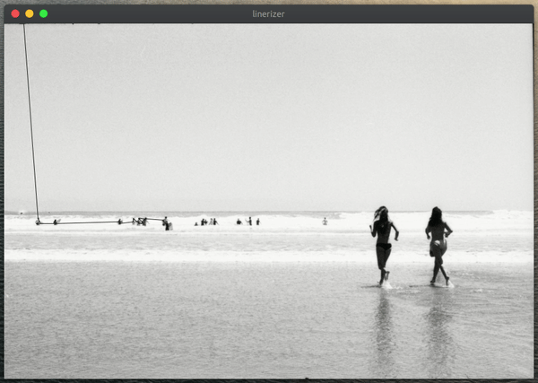

linerizer
=========

This Processing script takes a picture and redraws it in a single line.

To try it out, just drag and drop your image into the sketch window.
You can redraw the image by clicking on it. If you click on the upper half of the image, the algorithm draws the darker parts of the image, if you click on the lower half, the lighter parts are drawn.
Depending on where you click in x-direction, the drawing will look more or less dense.

Requires the [drop library](http://transfluxus.github.io/drop/).
